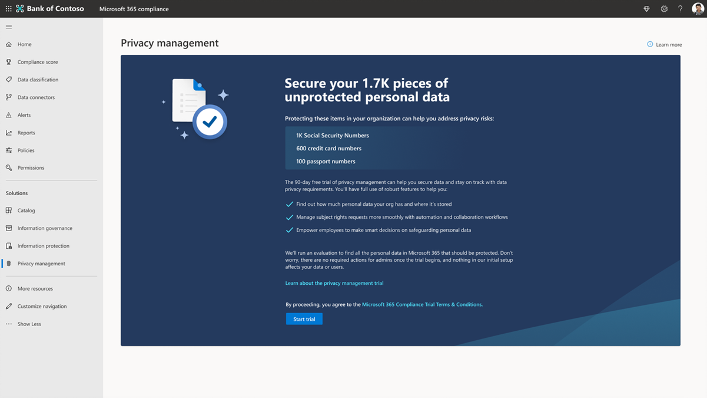
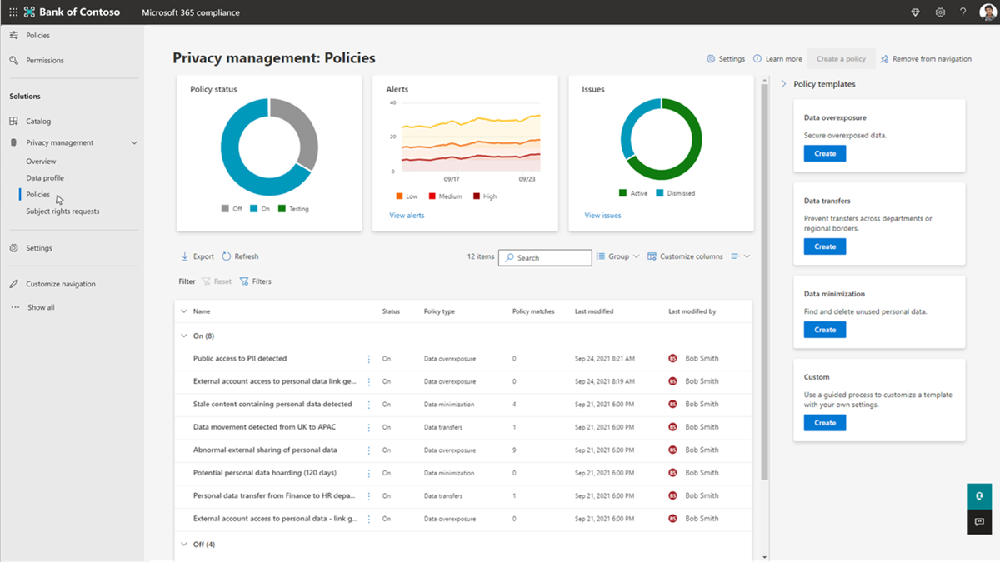
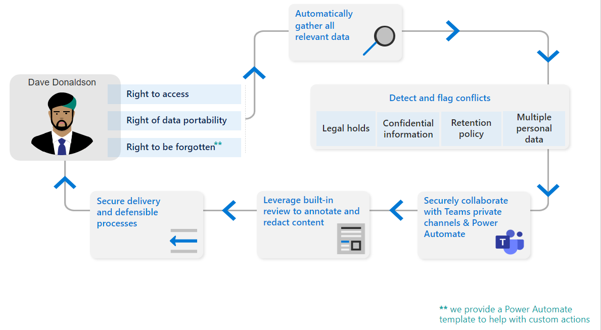

# 試用版劇本：Microsoft Priva

歡迎使用Microsoft Priva試用劇本。

此劇本可協助您保護個人資料，並建置具有隱私權彈性的工作場所，協助您充分利用 90 天的免費試用。

使用 Microsoft 建議，您將瞭解Priva如何協助您主動識別並防範隱私權風險，例如資料擷取、資料傳輸和資料過度共用、協助您的組織大規模自動化和管理主體要求，以及讓您的員工做出智慧型資料處理決策。

## 快速入門

*這些動作是有關在 90 天試用版中試用的主要功能建議。*

設定必要條件以開始試用。 請注意，Priva包含兩個主要解決方案，Priva 隱私權風險管理和Priva 主體權利要求，可分別嘗試和購買。 您可以在 Microsoft.com 上找到授權和購買詳細 [資料](https://www.microsoft.com/security/business/privacy/privacy-management-software?rtc=1#office-ContentAreaHeadingTemplate-8x0pmkp)。

### 隱私權風險管理

透過 **隱私權風險管理** 解決方案，您可以探索如何保護組織的個人資料，並建置具有隱私權彈性的工作場所。

- 主動識別並防範隱私權風險，例如資料擷取、資料傳輸和資料過度共用
- 取得個人資料儲存和移動的可見度
- 讓資訊工作者能夠做出處理此資料的智慧決策
- 讓使用者有效地管理資料，並採取步驟來遵守不斷演進的隱私權法規

### 主體權限要求

透過 **主體許可權要求** 解決方案，您可以瞭解如何處理從初始要求到產生報表的查詢。

- 大規模管理主體許可權要求

## 開始您的Microsoft Priva試用版

如果您已準備好開始使用Microsoft Priva，請遵循下列步驟來設定必要條件，並開始探索隱私權見解。

1. [確認訂用帳戶和授權](priva-setup.md#confirm-subscriptions-and-licensing)
1. [設定使用者權限並指派角色](priva-setup.md#set-user-permissions-and-assign-roles)
1. 選取 [開始試用]，將會為您完成下列作業：
    - Priva試用版授權會啟用， (這種情況會即時發生) 
    - 隱私權見解會產生 (這需要 24 小時) 

## 開始尋找隱私權風險並加以視覺化

Priva藉由自動化個人資料資產的探索，並提供基本資訊的視覺效果，協助您瞭解組織儲存的資料。

若要開始，請移至Microsoft Purview 合規性入口網站的[[Priva](https://compliance.microsoft.com/)] 區段並檢視下列頁面：

1. [概觀](priva-data-profile.md#explore-the-overview-page)：提供隱私權狀態的匯總檢視，包括Microsoft 365環境中的個人資料數量、類別、位置和移動。 此外，您可以看到個人資料過度共用、傳輸或未使用所造成的目前狀態和趨勢相關聯的隱私權風險。
1. [資料設定檔](priva-data-profile.md#explore-the-data-profile-page)：提供組織在Microsoft 365中儲存的個人資料快照集，包括儲存體和地理位置)  (磁片區、類型和位置。

## 瞭解原則

隱私權風險管理可讓您設定原則，以識別Microsoft 365環境中的隱私權風險，並啟用簡單的補救。

1. [瞭解重要風險案例](risk-management.md#learn-about-key-risk-scenarios)
1. [限制資料過度使用](risk-management.md#limit-data-overexposure)
1. [尋找並減輕資料傳輸](risk-management.md#find-and-mitigate-data-transfers)
1. [將儲存的資料最小化](risk-management.md#minimize-stored-data)

## 建立及自訂原則

在隱私權風險管理中建立新的原則，以解決對貴組織很重要的隱私權風險案例。 如需快速入門，請使用範本預設設定來建立資料過度使用、資料傳輸，以及資料最小化和案例的新原則。

1. [使用具有預設設定的範本建立原則](risk-management-policies.md#quick-setup-using-a-template-with-default-settings)
1. [透過自訂範本設定來建立原則](risk-management-policies.md#custom-setup-guided-process-to-choose-all-settings)
1. [瞭解所有原則的金鑰設定](risk-management-policies.md)
1. [瞭解資料最小化原則的設定](risk-management-policy-data-minimization.md)
1. [瞭解資料傳輸原則的設定](risk-management-policy-data-transfer.md)
1. [瞭解資料過度匯出原則的設定](risk-management-policy-data-overexposure.md)

## 管理原則

在隱私權風險管理中建立原則以處理資料最小化、資料傳輸或資料過度公開案例之後，您可能想要檢閱或更新原則設定。 您可能也想要在完全推出新原則以供持續使用之前，先測試新原則。

1. [檢視原則詳細資料](risk-management-policies-manage.md#view-details-and-activity-from-the-policy-details-page)
1. [測試您的原則](risk-management-policies-manage.md#testing-a-policy)
1. [刪除原則](risk-management-policies-manage.md#delete-a-policy)

## 了解原則警示和問題

檢閱警示可讓您識別需要追蹤的案例。 您可以建立問題，讓使用者有結構化的方式來檢閱內容、指派問題的嚴重性，並共同努力修復問題。

1. [檢視目前的警示和問題](risk-management-alerts.md#view-current-alerts-and-issues)
1. [管理警示](risk-management-alerts.md#manage-alerts)
1. [管理問題](risk-management-alerts.md#manage-issues)
1. [檢閱內容並補救問題](risk-management-alerts.md#review-content-and-remediate-issues)

## 傳送使用者原則通知

隱私權風險管理可以直接通知內容擁有者您的資料過度公開、資料最小化和資料傳輸原則的相符專案。 透過電子郵件通知，您的使用者可以輕鬆地找出他們需要檢閱的內容。

1. [準備原則通知的訓練內容](risk-management-notifications.md#prepare-training-content-for-notifications)
1. [設定原則的電子郵件通知](risk-management-notifications.md#set-user-email-notifications)
1. [預覽和自訂電子郵件通知](risk-management-notifications.md#preview-and-customize-email-content)
1. [在 Teams 中傳送通知](risk-management-notifications.md#send-notifications-in-teams)

## 了解主體權限要求

根據世界各地的特定隱私權法規，個人 (或資料主體) 可能會要求檢閱或管理公司所收集的個人資料。 這些要求有時也稱為資料主體要求， (DSR) 、資料主體存取要求 (DSAR) 或取用者權利要求。 Priva 主體權利要求可協助您處理這些查詢。

1. [建立要求並收集資料](subject-rights-requests-create.md)
1. [資料比對](subject-rights-requests-data-match.md)
1. [檢閱資料並共同處理要求](subject-rights-requests-data-review.md)
1. [履行要求](subject-rights-requests-reports.md)
1. [自動化工作](subject-rights-requests-automate.md)

## 建立主體權利要求

主體版權管理系統管理員可以透過主要的主體許可權要求頁面開啟新的主體許可權要求。 精靈會引導您完成尋找資料主體相關個人資料的程式，並開始完成其要求的程式。

1. [使用主體許可權要求精靈](subject-rights-requests-create.md#custom-setup-guided-process-to-choose-all-settings) – 建立要求
1. [定義搜尋設定](subject-rights-requests-create.md#defining-search-settings)
1. [精簡搜尋設定](subject-rights-requests-create.md#refining-your-search)

## 管理主體許可權要求的資料比對

透過資料比對，組織可以讓Priva根據確切提供的資料值來識別資料主體。

1. [準備資料匯入](subject-rights-requests-data-match.md#prepare-for-data-import)
1. [定義個人資料架構](subject-rights-requests-data-match.md#define-the-personal-data-schema)
1. [Upload個人資料](subject-rights-requests-data-match.md#upload-personal-data)

## 在主體權利要求上查看資料和共同作業

建立主體許可權要求之後，Priva將使用您主體的相關輸入，在組織的Microsoft 365環境中尋找相符專案。 編譯此資料之後，您可以檢閱結果、選擇要包含的專案，以及視需要修訂資訊。

1. [檢閱要求詳細資料並監視進度](subject-rights-requests-workflow.md)
1. [檢視和編輯搜尋查詢](subject-rights-requests-create.md#defining-search-settings)  (選擇性) 
1. [檢閱資料](subject-rights-requests-data-review.md)
1. [關閉要求](subject-rights-requests-reports.md)

## 管理主體權利要求報告及履行要求

完成主體許可權要求的資料檢閱之後，您可以繼續要求履行。

1. [準備資料主體的最終報告](subject-rights-requests-reports.md)
1. [透過 Microsoft 圖形 API 與 Power Automate 整合和擴充](subject-rights-requests-automate.md)
1. [管理資料保留](subject-rights-requests-reports.md#retention-periods-for-reports-and-data)

## 使用 Power Automate 擴充

為Priva啟用Power Automate流程，以自動化案例和使用者的重要工作，例如在 ServiceNow 中建立票證或新增到期日相關行事曆提醒。

1. [從範本建立新的Power Automate流程](subject-rights-requests-automate.md#create-a-new-power-automate-flow-from-a-template)
1. [共用Power Automate流程](subject-rights-requests-automate.md#share-a-power-automate-flow)
1. [編輯或刪除Power Automate流程](subject-rights-requests-automate.md#edit-or-delete-power-automate-flow)

## 其他資源

**Microsoft Docs**：取得Microsoft Priva運作方式，以及如何為組織最佳實作的詳細資訊。 [請造訪檔](priva-overview.md)。

**為何Microsoft Priva**：深入瞭解此 [影片](https://www.youtube.com/watch?v=6OLky1biPIQ)中的Priva功能。

**深入瞭解Microsoft Priva**：部落格、方案 [、定價。](https://aka.ms/privacymgmt/web)

**購買Microsoft Priva**：隱私權風險管理和主體權利要求會分別銷售。 您可以在 Microsoft.com 上找到授權和購買詳細 [資料](https://www.microsoft.com/en-us/security/business/privacy/privacy-management-software?rtc=1#office-ContentAreaHeadingTemplate-8x0pmkp)。
