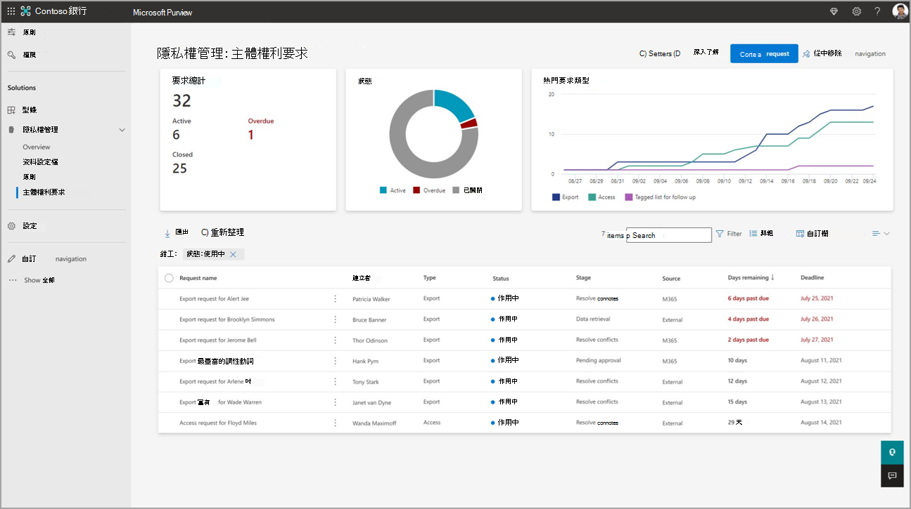

# 瞭解工作流程和要求詳細資料頁面

**在本文中**：瞭解建立和處理要求時的進度步驟。 瞭解如何在每個要求的詳細資料頁面上使用深入解析和功能。

當您在主體許可權要求解決方案中[建立要求](subject-rights-requests-create.md)時，您提供的資訊會用來尋找組織Microsoft 365環境中資料主體的相符專案。 符合的專案會進行編譯，供您檢閱、選擇要包含的專案，以及視需要修訂資訊。 多位使用者可以在 [主體許可權要求] 介面中共同作業這些步驟。 要求的 [ [概觀](#overview-tab) ] 頁面會提供進度階段的狀態，以及要採取之後續步驟的指引。

## 要求的進度階段

每個要求都會經歷多個階段。 某些階段會自動進行，而其他階段則會在完成某些步驟之後手動進行，例如檢閱檔案。

- **資料估計**：在擷取資料之前，Priva估計預期要尋找的資料量。 視資料量而定，要求可能會自動移至資料擷取的下一個階段。 您可以在收集資料之前，將要求設定為在估計階段暫停;深入瞭解 [資料估計和擷取](subject-rights-requests-data-retrieval.md)。

- **擷取資料**：所有檔案、電子郵件、聊天、影像和其他內容專案都會提取在一起。 當此階段完成時，要求會自動移至檢閱資料的下一個階段。 深入瞭解 [資料估計和擷取](subject-rights-requests-data-retrieval.md)。

- **檢閱資料**：共同作業者會檢閱收集的所有資料、決定與要求相關的資料，以及執行修訂檔案和新增案例附注等工作。 深入瞭解檢 [閱主體許可權要求的資料](subject-rights-requests-data-review.md)。 完成資料檢閱之後，您會手動前進到下一個階段來產生報告。

- **產生報告**：資料檢閱完成時，使用者會手動前進到此步驟。 Priva會產生最終報告，其中包括要與資料主體共用的資料套件，以及您組織記錄的內部報告。 深入瞭解 [產生報表](subject-rights-requests-reports.md)。

- **關閉要求**：當所有工作都完成時，請關閉要求，以指出該要求已視為已完成。 深入瞭解 [如何產生報](subject-rights-requests-reports.md) 表，讓您可以滿足並關閉要求。

## 瞭解要求詳細資料頁面

從 Microsoft Purview 合規性入口網站的左側導覽中選 **取 [Priva 主體權利要求**]，以存取您組織建立的要求並檢視其狀態。 主 [主體權利要求] 頁面上的狀態卡如下所示，顯示作用中、已關閉和逾期要求的數目，以及最高要求類型。 狀態卡下方的表格會列出您組織所建立的所有要求，最上方有最近建立的要求。

**主體許可權要求主頁面：**  
 

若要開啟要求的詳細資料頁面，請從資料表中選取要求名稱。 您可以在這裡深入瞭解要求的屬性、搜尋結果和要求的狀態。 如下所示的詳細資料頁面會成為您的中樞，以便在管理找到的檔案、建立報表和匯出，以及完成要求時共同作業。

**要求詳細資料頁面：** 
 

### 概觀索引標籤

要求詳細資料頁面的 [ **概觀** ] 索引標籤會提供要求的詳細資料、顯示您目前步驟的進度指示器，以及找到之資料的重要資訊。 此頁面有個別的狀態卡，如下所述。

##### 詳細資料

**[詳細資料**] 卡片會顯示基本資訊，以引導您進行要求，例如其期限、建立日期、描述和相關的隱私權規定。

##### 進度

**進度** 卡片會列出程式中的每個步驟：[資料估計]、[擷取資料]、[檢閱資料]、[產生報告] 和 [關閉要求]。 步驟旁邊的填滿藍色圓圈表示您目前使用的步驟。 藍色圓圈內的核取記號表示步驟已完成。 空白的空白圓圈表示步驟尚未啟動。

##### 資料估計摘要

當要求在 **資料預估** 階段暫停時，會顯示 [[資料估計](subject-rights-requests-data-retrieval.md#data-estimate)摘要] 卡片。 它會顯示搜尋預期要擷取的位置和專案數目。

##### 找到的專案總數

[**找到的專案總數**] 卡片會顯示找到的內容專案數目及其在Microsoft 365中的位置。

##### 要檢閱的優先順序專案

[ **要檢閱的優先順序專案** ] 圖格會顯示您在開始檢閱時可能想要設定優先順序的專案。 磚會顯示屬於下列類別的專案計數：
- **機密**：這些專案已套用 [Microsoft 敏感度標籤](/microsoft-365/compliance/sensitivity-labels) 。 例如，具有「高度機密」標籤的 Word 檔。 
- **多人資料**：這些專案包含一個以上人員的個人資料。 如果您想要將這些專案包含為最終資料封裝的一部分，則必須修訂檔案中不相關的資料。 取得 [有關檢閱資料的詳細資料](subject-rights-requests-data-review.md)。 為了讓Priva識別具有多人資料的專案，您的組織必須設定[主體許可權要求的資料比對](subject-rights-requests-data-match.md)。

**如何找出您的優先順序專案：**

首先，請遵循下列步驟，確定您已在資料 **收集** 的專案資料表中啟用它們的檢視：

- 在 [ **收集的資料] 索引** 標籤上，選取專案清單頂端的 [ **自訂** 資料行]。
- 在 [ **編輯資料行]** 飛出視窗窗格中，于 [ **優先順序類型**] 旁放置檢查。
- 選取 **[套用]**。 您的專案清單現在會有 **[優先順序類型]** 資料行。

現在您可以識別優先順序專案，並藉由排序 **[優先順序類型** ] 資料行來將類似的類型分組來尋找它們。

### 收集的資料索引標籤

識別出符合您搜尋設定的所有專案時，系統會在 [收集的資料] 索引 **標籤上** 收集並呈現這些專案。專案清單旁是預覽畫面，可檢閱每個專案、進行修訂，以及將專案標示為包含或排除為要求的一部分。 深入瞭解 [資料檢閱和共同作業步驟](subject-rights-requests-data-review.md)。

### [記事] 索引標籤

[ **記事]** 索引標籤可讓共同作業者輸入有關在要求上完成之工作的附注。 在要求上工作的每個人都可以看到這些附注，但不會包含在最終報表中，或是以其他方式與資料主體共用。

### 共同作業者索引標籤

[共同作業者] 索引標籤會顯示所有受邀共同作業所收集資料的使用者，以及要求的任何相關聯Teams通道。 要求的建立者會自動列為共同作業者。 選取 [ **新增共同作業** 者] 命令並輸入使用者的名稱，以從清單中選取他們，以邀請新的共同作業者。 深入瞭解 [資料檢閱的共同作業詳細資料](subject-rights-requests-data-review.md#collaboration-for-data-review)

### [報表] 索引標籤

[ **報表]** 索引標籤會顯示當您進入 [ **產生報告** ] 階段時自動產生的所有報表。 報表分成兩個類別：供您與資料主體共用的報表，以及適用于組織內部使用的報告。 取得 [使用報表的詳細資料](subject-rights-requests-reports.md)。

### [歷程記錄] 索引標籤

[ **歷程記錄]** 索引標籤會摘要說明要求的最上層事件，包括進度階段變更，以及包含、排除和修訂的專案數目匯總。

## 後續步驟

請造訪 [建立主體許可權要求](subject-rights-requests-create.md) ，以瞭解如何使用您的第一個要求來陳述。

## 法律免責聲明

[Microsoft Priva法律免責聲明](priva-disclaimer.md)