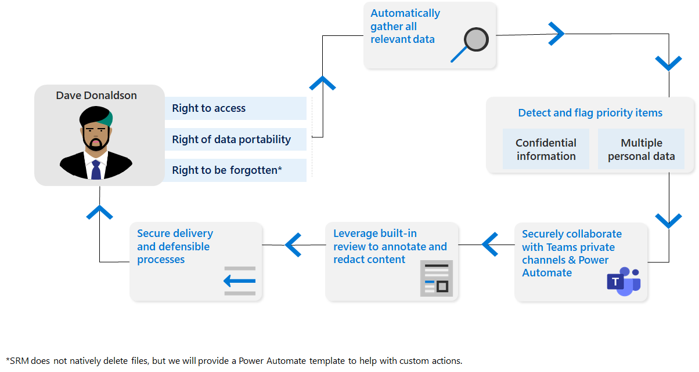

# 深入瞭解主題權力要求

根據世界各地的某些隱私權規定，個人 (或 *資料主體*) 可能要求複查或管理公司所收集的個人資料。 這些要求有時也稱為資料主體要求 (Dsr) 、資料主體存取要求 (DSARs) 或使用者權限要求。 針對儲存大量資訊的公司，尋找相關資料可能是一項艱巨的工作。

隱私權管理可協助您透過主體許可權要求來處理這些查詢。 它提供工作流程、自動化和共同作業功能，協助您搜尋主體資料、查看您的結果、收集適當的檔案，並產生報告。

## 隱私權管理如何支援遵循主體權力要求

主體權利要求週期始于組織的個人要求。 收到後，您就可以使用隱私權管理的功能來收集該資料、共同作業、審閱及建立報告。 然後，您可以通知資料的主體，並採取隱私權管理以外的任何其他動作來完成要求，例如刪除資料。 若要協助您同時管理和自動化工作流程，您也可以使用隱私權管理的整合式 Power Automate 範本。

### 建立要求並收集資料

隱私權管理可提供強大的搜尋選項，以在您的組織儲存在 Microsoft 365 中的內容中尋找與資料主體相關的資料。 它也可協助您排定專案的優先順序，以在您為這些要求收集的資料中進行審閱。 隱私權管理會察覺 Microsoft 資訊保護敏感度標籤，表示可能有機密的內容，而且可能需要特殊檢查，並使用這些標籤專案。 此外，隱私權管理可以偵測和旗標專案，其中可能包含多個人員的資料，而您可能需要在將內容提供給資料主體之前，將內容密文。

若要深入瞭解，請參閱 [建立主體權力要求](privacy-management-subject-rights-requests-create.md)。

### 資料符合

使用資料比對，您可以啟用隱私權管理，根據正確提供的資料值來識別資料主體。 上傳這種類型的資訊有助於提高尋找內容的精確度，也簡化了建立主體許可權要求時手動提供欄位的需要。 它也會提供主題許可權要求中的內容，以及顯示最多資料主體內容之專案的總覽磚。 若要深入瞭解，請參閱 [管理資料符合](privacy-management-subject-rights-requests-data-matching.md)。

### 查看要求的資料並進行共同作業

收集資料後，您可以評估結果，選取要包含在報表和匯出中的最相關專案，以及進行任何必要的密文。 這可以在隱私權管理管線中的小組成員之間，以協調方式完成。
若要深入瞭解，請參閱 [對主體權力要求進行審閱與共同](privacy-management-subject-rights-requests-review.md)作業。

### 完成要求

隱私權管理可讓您建立報表及收集要傳送回資料主體的檔。 若要深入瞭解，請參閱 [Manage subject rights requests 出口和履行要求](privacy-management-subject-rights-requests-fulfill.md)。

### 自動化工作

您可以使用內建的 Power Automate 範本，在隱私權管理內建立及自動化工作流程處理常式。 這些範本支援 ServiceNow 中的「歸檔票據」或設定行事曆邀請等工作。 若要深入瞭解，請參閱 [自動化主體權力要求任務](privacy-management-subject-rights-requests-automate-tasks.md)。

## 法律免責聲明

[隱私權管理法律免責聲明](privacy-management-disclaimer.md)
